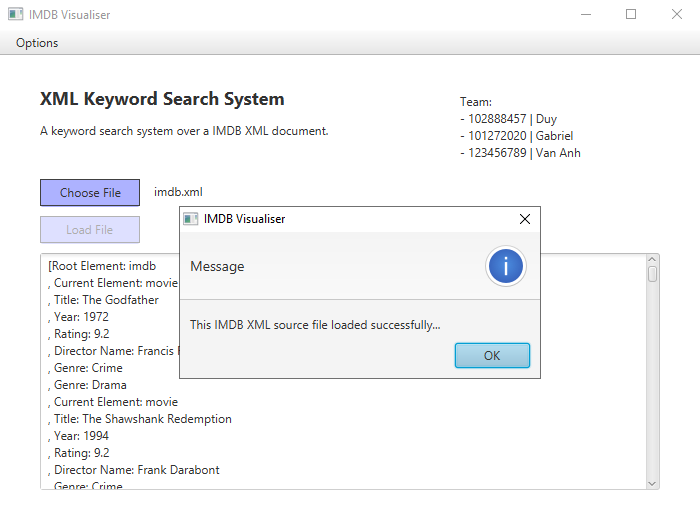
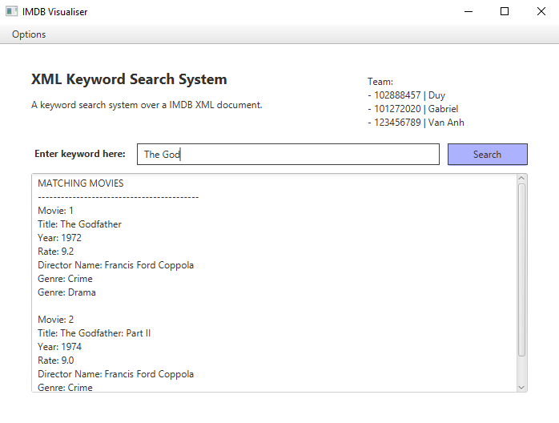
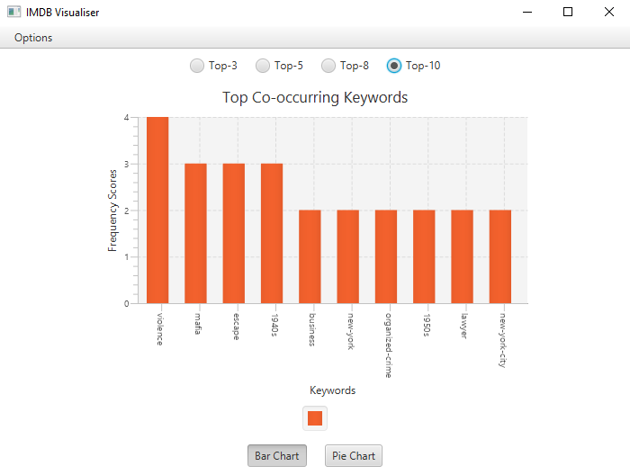
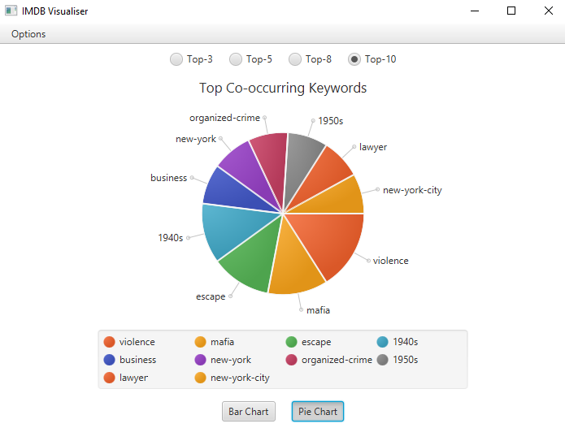

# IMDB
IMDB is a keyword search system over XML documents of information related to films. Indeed, it help users to both search movies by their titles and visualise top-keywords associated with these movies in different charts. The application has been implemented using following technologies:
- JavaFX
- Java SAX
- Java Comparator

## Screenshots
**Parsing XML Document**  

**Searching Movies**  

**Visualising Top-keywords**  
 

## How to use it?
The application can run on any machine running Java.
- **Step 1**: Look for the imdb.jar file inside the arc folder and put it in your desirable folder.
- **Step 2**: Click on the jar file to run the application.
